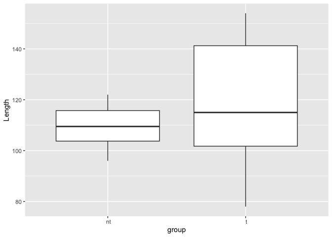
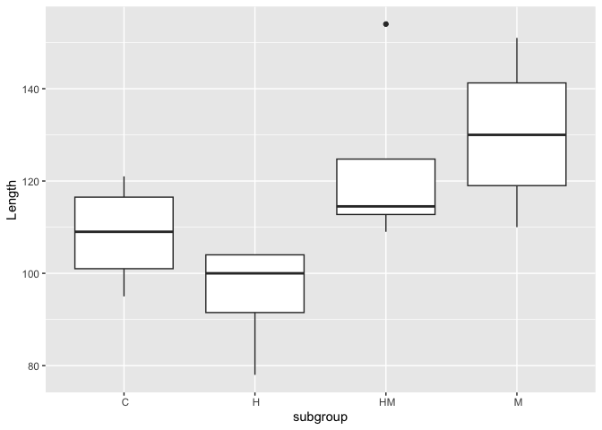

oyster project 1
================
Noah Krebs
2023-07-07

I want to graph intitial size data.

``` r
library(tidyverse)
```

    ## ── Attaching core tidyverse packages ──────────────────────── tidyverse 2.0.0 ──
    ## ✔ dplyr     1.1.1     ✔ readr     2.1.4
    ## ✔ forcats   1.0.0     ✔ stringr   1.5.0
    ## ✔ ggplot2   3.4.1     ✔ tibble    3.2.1
    ## ✔ lubridate 1.9.2     ✔ tidyr     1.3.0
    ## ✔ purrr     1.0.1     
    ## ── Conflicts ────────────────────────────────────────── tidyverse_conflicts() ──
    ## ✖ dplyr::filter() masks stats::filter()
    ## ✖ dplyr::lag()    masks stats::lag()
    ## ℹ Use the conflicted package (<http://conflicted.r-lib.org/>) to force all conflicts to become errors

REad in data

There are three interrelated rules which make a dataset tidy:

Each variable must have its own column. Each observation must have its
own row. Each value must have its own cell.

``` r
init <- read.csv("../data/initial-shell-length.csv", header = TRUE)
```

``` r
ggplot(data = init, mapping = aes(x = history, y = Length)) + 
  geom_boxplot()
```

<!-- -->

``` r
oysdata <- read.csv("../data/sampling-data.csv", header = TRUE)
```

``` r
ggplot(data = oysdata, mapping = aes(x = Sex, y = Length)) + 
  geom_boxplot()
```

<!-- -->

``` r
ggplot(data = oysdata, mapping = aes(x = group, y = Length)) + 
  geom_boxplot()
```

<!-- -->

``` r
ggplot(data = oysdata, mapping = aes(x = subgroup, y = Length)) + 
  geom_boxplot()
```

<!-- -->

``` r
ggplot(data = oysdata, mapping = aes(y = Length)) + 
  geom_bar()
```

<!-- -->

``` r
ggplot(data = oysdata, mapping = aes(x = Individual, y = Length)) + 
  geom_boxplot()
```

<!-- -->
