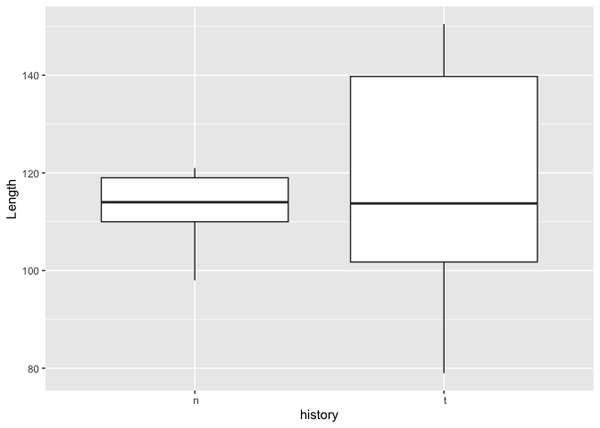
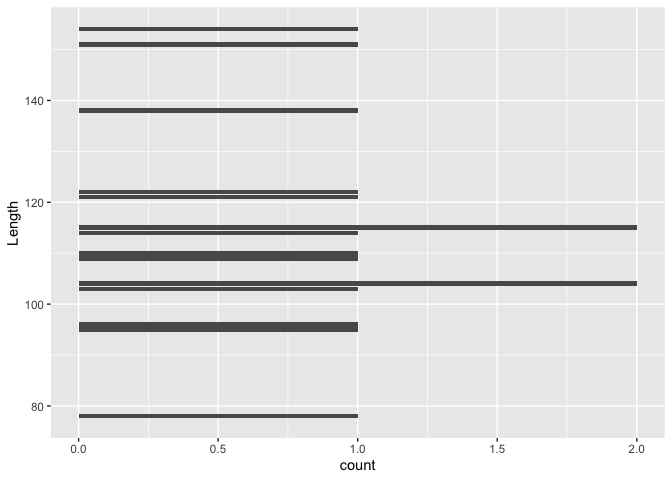

oyster project 1
================
Noah Krebs
2023-07-07

I want to graph intitial size data.

``` r
library(tidyverse)
```

    ## ── Attaching core tidyverse packages ──────────────────────── tidyverse 2.0.0 ──


REad in data

There are three interrelated rules which make a dataset tidy:

Each variable must have its own column. Each observation must have its
own row. Each value must have its own cell.

``` r
init <- read.csv("../data/initial-shell-length.csv", header = TRUE)
```

``` r
ggplot(data = init, mapping = aes(x = history, y = Length)) + 
  geom_boxplot()
```

<!-- -->

``` r
oysdata <- read.csv("../data/sampling-data.csv", header = TRUE)
```

``` r
ggplot(data = oysdata, mapping = aes(x = Sex, y = Length)) + 
  geom_boxplot()
```

<!-- -->

``` r
ggplot(data = oysdata, mapping = aes(x = group, y = Length)) + 
  geom_boxplot()
```

<!-- -->

``` r
ggplot(data = oysdata, mapping = aes(x = subgroup, y = Length)) + 
  geom_boxplot()
```

<!-- -->

``` r
ggplot(data = oysdata, mapping = aes(y = Length)) + 
  geom_bar()
```

<!-- -->
<<<<<<< HEAD
=======

``` r
ggplot(data = oysdata, mapping = aes(x = Individual, y = Length)) + 
  geom_boxplot()
```

<!-- -->

