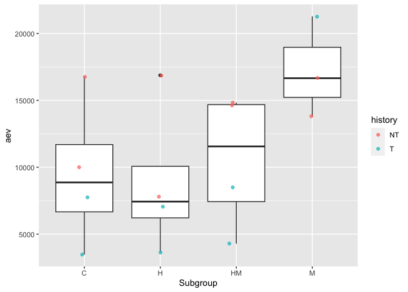
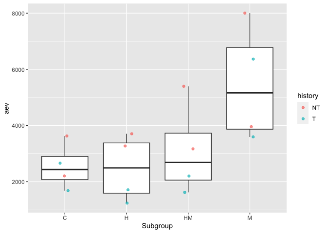

qPCR
================
2023-07-21

``` r
library(tidyverse)
```

    ## ── Attaching core tidyverse packages ──────────────────────── tidyverse 2.0.0 ──
    ## ✔ dplyr     1.1.0     ✔ readr     2.1.4
    ## ✔ forcats   1.0.0     ✔ stringr   1.5.0
    ## ✔ ggplot2   3.4.1     ✔ tibble    3.1.8
    ## ✔ lubridate 1.9.2     ✔ tidyr     1.3.0
    ## ✔ purrr     1.0.1     
    ## ── Conflicts ────────────────────────────────────────── tidyverse_conflicts() ──
    ## ✖ dplyr::filter() masks stats::filter()
    ## ✖ dplyr::lag()    masks stats::lag()
    ## ℹ Use the conflicted package (<http://conflicted.r-lib.org/>) to force all conflicts to become errors

Converted Cq value to aev with: =10^(-(0.3012 \* E2) + 11.434)

``` r
qpcr <- read.csv("../data/SR-qpcr-data-1.csv", header = TRUE) 
```

``` r
ggplot(data = qpcr, mapping = aes(x = Subgroup, y = CqMean)) + 
  geom_boxplot()  +
  facet_wrap('Target')
```

    ## Warning: Removed 1 rows containing non-finite values (`stat_boxplot()`).

<!-- -->

``` r
ggplot(data = qpcr, mapping = aes(x = Subgroup, y = aev)) + 
  geom_boxplot() +
  facet_wrap('Target')
```

    ## Warning: Removed 1 rows containing non-finite values (`stat_boxplot()`).

<!-- -->

``` r
qpcr %>%
  filter(Target == "Cg_18s(1408/9)") %>%
ggplot(mapping = aes(x = Subgroup, y = aev)) + 
  geom_boxplot()  +
  geom_jitter(aes(color = history), width = 0.1, alpha = 0.7)
```

<!-- -->

``` r
qpcr %>%
  filter(Target == "Cg_GAPDH(1172/3)")  %>%
ggplot(mapping = aes(x = Subgroup, y = aev)) + 
  geom_boxplot()  +
  geom_jitter(aes(color = history), width = 0.1, alpha = 0.7)
```

    ## Warning: Removed 1 rows containing non-finite values (`stat_boxplot()`).

    ## Warning: Removed 1 rows containing missing values (`geom_point()`).

<!-- -->

``` r
qpcr %>%
  filter(Target == "Cg_ATPsynthase(1385/6)")  %>%
ggplot(mapping = aes(x = Subgroup, y = aev)) + 
  geom_boxplot()  +
  geom_jitter(aes(color = history), width = 0.1, alpha = 0.7)
```

<!-- -->

``` r
qpcr %>%
  filter(Target == "Cg_citratesynthase(1383/4)")  %>%
ggplot(mapping = aes(x = Subgroup, y = aev)) + 
  geom_boxplot()  +
  geom_jitter(aes(color = history), width = 0.1, alpha = 0.7)
```

<!-- -->
